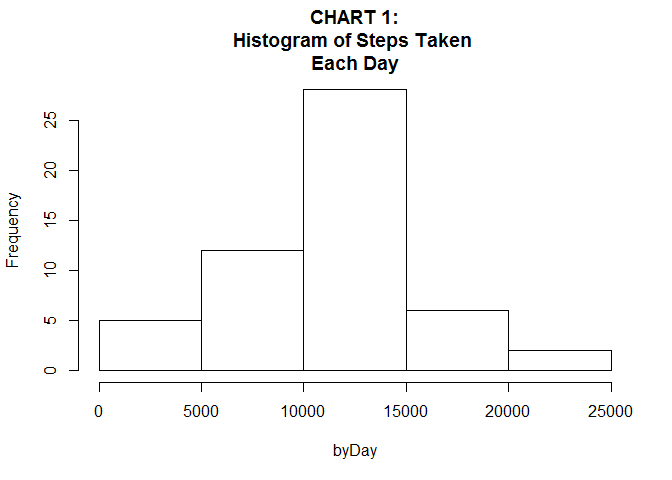
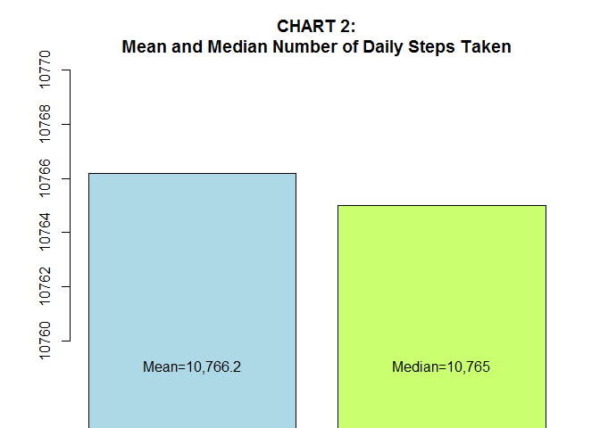
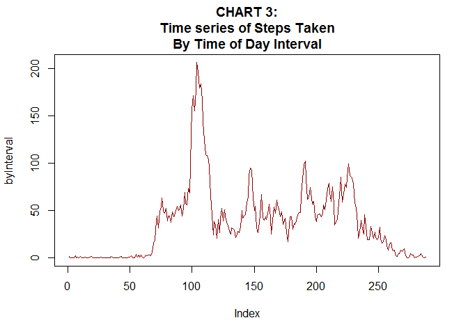
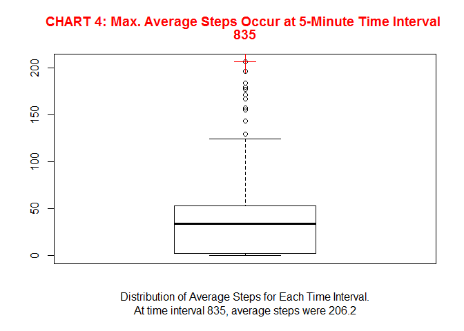
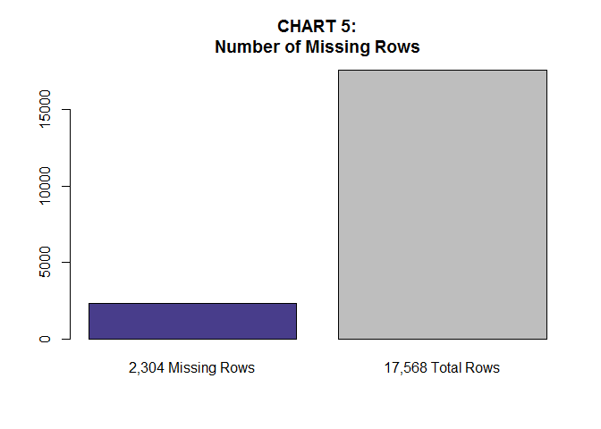
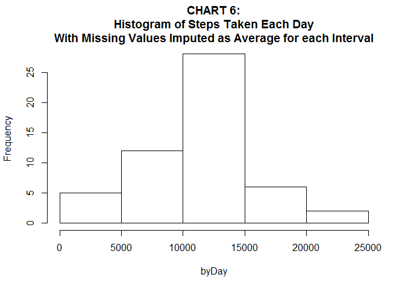
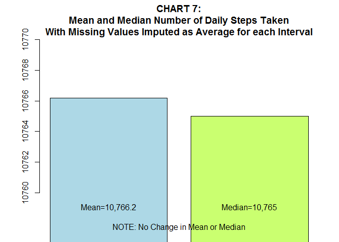
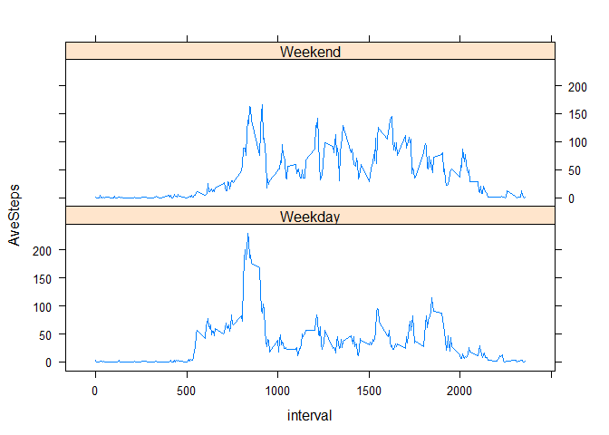

This assignment makes use of data from a personal activity monitoring device. This device collects data at 5 minute intervals throughout the day.

The data consists of two months of data from an anonymous individual collected during the months of October and November, 2012, including the number of steps taken in 5 minute intervals each day.

The first step in the analysis is to **read in the CSV file 'Activity monitoring data.csv'** from the local working directory.

``` r
setwd("~/Data Science Training/Coursera/Data Science Specialization/Course 5 Reproducible Research/Week 2/Data/repdata-data-activity")
WalkData<-read.csv("activity.csv")
```

The variables included in this dataset are:

-   steps: Number of steps taking in a 5-minute interval (missing values are coded as NA)

-   date: The date on which the measurement was taken in YYYY-MM-DD format

-   interval: Identifier for the 5-minute interval in which measurement was taken

Next, with the R script below, create Charts 1-2 which follow:

-   **A histogram of the total steps taken each day of the study period.**
-   **The mean and median number of steps taken each day.**

``` r
byDay<-tapply(WalkData$steps[!is.na(WalkData$steps)],WalkData$date[!is.na(WalkData$steps)],sum)

par(mfrow=c(1,1))
hist(byDay, main="CHART 1:\nHistogram of Steps Taken \nEach Day")
```

<!-- -->

``` r
#Calculate and plot the mean and median steps by day.
byDayMean<-mean(byDay[!is.na(byDay)])
byDayMedian<-median(byDay[!is.na(byDay)])
 
barplot(c(byDayMean,byDayMedian), main="CHART 2:\nMean and Median Number of Daily Steps Taken",col = c("lightblue", "darkolivegreen1"), names.arg=c("Mean=10,766.2","Median=10,765"),
        ylim=c(10760,10770))
```

<!-- -->

Next, Create Chart 3, a **Time series plot of the average number of steps taken.**

``` r
byInterval<-tapply(WalkData$steps[!is.na(WalkData$steps)],WalkData$interval[!is.na(WalkData$steps)],mean)

par(mfrow=c(1,1))
plot(byInterval, main="CHART 3:\nTime series of Steps Taken\nBy Time of Day Interval",type = "l",col="darkred")
```

<!-- -->

``` r
#Optional Linear Trend line, not included with the current chart.
#abline(lsfit(1:288, byInterval))
#text(29,38, "linear trend", col = "black", font=1,srt=2)
```

Build Chart 4 -- **Show 5-Minute Time Interval with Maximum Average Steps**, From the above, find the 5-minute interval, on average across all the days in the dataset, which contains the maximum number of steps:

``` r
maxINterval=data.frame(byInterval[byInterval==max(byInterval)])
maxINterval
```

    ##     byInterval.byInterval....max.byInterval..
    ## 835                                  206.1698

``` r
maxINtervalName<-rownames(maxINterval)
boxplot(byInterval)
points(maxINterval,pch=3, col="red",cex=3) 
title( main=list(c("CHART 4: Max. Average Steps Occur at 5-Minute Time Interval ",maxINtervalName),col="red"),xlab="Distribution of Average Steps for Each Time Interval.\nAt time interval 835, average steps were 206.2")
```

<!-- -->

Next, create Charts 5-7, **Calculate and report the missing value count, and Build Code to impute missing values, and create a revised Histogram and Mean and Median Chart with the Imputed data included.** by replacing missing observations of step counts with the respective average for each of the corresoponding observed intervals.

``` r
# combine data frames of average steps by interval and of column lables
intervalNames<-data.frame(rownames(data.frame(byInterval)))
colnames(intervalNames)<-"interval"

IntervalAverages<-data.frame(c(data.frame(rownames(data.frame(byInterval))),data.frame(byInterval)))
colnames(IntervalAverages)<-c("interval","Average_Interval_Steps")

#Chart 5 - First calculate and plot the number of missing rows in the data set:
RowsAll=length(WalkData$steps)
RowsNA=length(WalkData$steps[is.na(WalkData$steps)])

par(mfrow=c(1,1))
barplot(c(RowsNA,RowsAll), main="CHART 5:\nNumber of Missing Rows",col = c("darkslateblue","grey"), names.arg=c("2,304 Missing Rows","17,568 Total Rows"))
```

<!-- -->

``` r
#Next, impute Values by merging interval averages with rows missing step counts.
WalkDataImputed <- merge(WalkData,IntervalAverages,by="interval")

WalkDataImputed[is.na(WalkDataImputed$steps),]$steps <-WalkDataImputed[is.na(WalkDataImputed$steps),]$Average_Interval_Steps

#Create Chart 6, a Histogram as done in Chart 1, replacing missing observations with averages at each interval, then summing each day.
byDayImputed<-tapply(WalkDataImputed$steps,WalkDataImputed$date,sum)
hist(byDay, main="CHART 6:\nHistogram of Steps Taken Each Day\nWith Missing Values Imputed as Average for each Interval")
```

<!-- -->

``` r
#Create Chart 7, Calculate and plot the mean and median steps by day.
byDayMeanImputed<-mean(byDayImputed[!is.na(byDay)])
byDayMedianImputed<-median(byDayImputed[!is.na(byDay)])

par(mfrow=c(1,1))
barplot(c(byDayMeanImputed,byDayMedianImputed), main="CHART 7:\nMean and Median Number of Daily Steps Taken\nWith Missing Values Imputed as Average for each Interval",col = c("lightblue", "darkolivegreen1"), names.arg=c("Mean=10,766.2","Median=10,765"), xlab="NOTE: No Change in Mean or Median", ylim=c(10760,10770))
```

<!-- -->

Finally, Create Chart 8: **Calculate and plot a Comparison of Weekday vs. Weekend Step counts.**

``` r
WalkDataImputed$weekdayInd<-with(WalkDataImputed, !(weekdays(as.Date(WalkDataImputed$date))=="Saturday" | weekdays(as.Date(WalkDataImputed$date))=="Sunday")) 

#PANEL PLOT using lattice library
WalkDataImputed$TimePeriod[WalkDataImputed$weekdayInd==0]<-"Weekend"
WalkDataImputed$TimePeriod[WalkDataImputed$weekdayInd==1]<-"Weekday"

library(dplyr)
```

    ## Warning: package 'dplyr' was built under R version 3.2.4

    ## 
    ## Attaching package: 'dplyr'

    ## The following objects are masked from 'package:stats':
    ## 
    ##     filter, lag

    ## The following objects are masked from 'package:base':
    ## 
    ##     intersect, setdiff, setequal, union

``` r
WalkDataImputed.SMRY <- group_by(WalkDataImputed, TimePeriod,interval)
WalkDataImputed.SMRY<-summarize(WalkDataImputed.SMRY, AveSteps = mean(steps, na.rm = TRUE))

library(lattice)
xyplot(AveSteps ~ interval | TimePeriod, data = WalkDataImputed.SMRY, layout = c(1, 2),type = "l")
```

<!-- -->

**Thank you. This is the end of the report**
